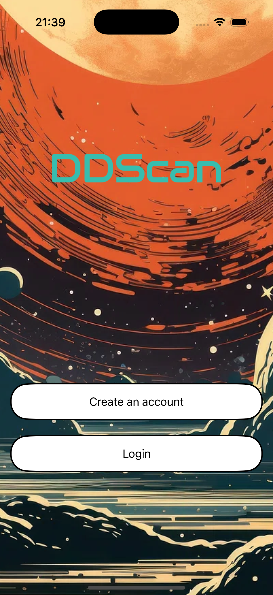

# DDScan

DDScan is a mobile application built with SwiftUI for reading manga scans!

## Features
- Smooth manga reading experience.
- Easy navigation between chapters.
- Modern and intuitive user interface.

## Screenshots

### Welcome Screen

### Home Screen

### Chapter Reading

